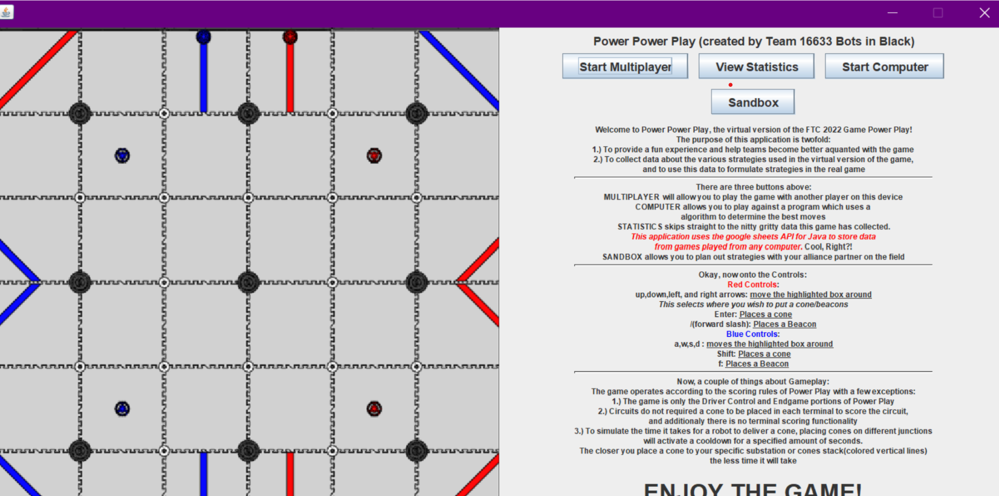
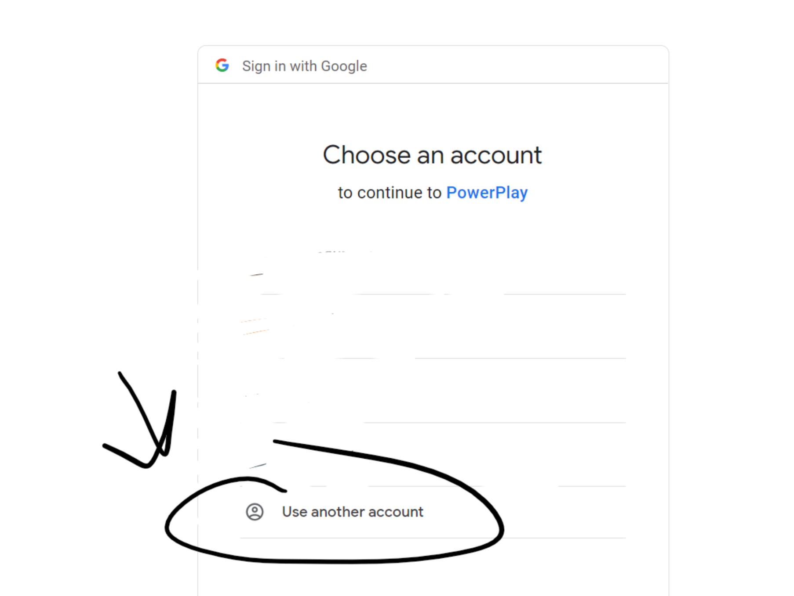

**Steps to use PowerPlay Game on Windows**

First, make sure you have the JDK(java development kit installed. You can easily install it from this [link](https://download.oracle.com/java/19/latest/jdk-19_windows-x64_bin.exe)

Then run the Power Power PlayV3 exe file to ensure everything is working. If you get a message saying a JNI error has occurred it is probably because you didn't download the JDK

-To upload and view statistics press the Statistics button. It will redirect you to a web browser and it will ask you to log into an email

Use the email provided below

email:PowerPowerPlayGuest

password:Robotics123

-Once you fill out the email it should take you to the statistics window and you won't be prompted to enter in an email  again.

